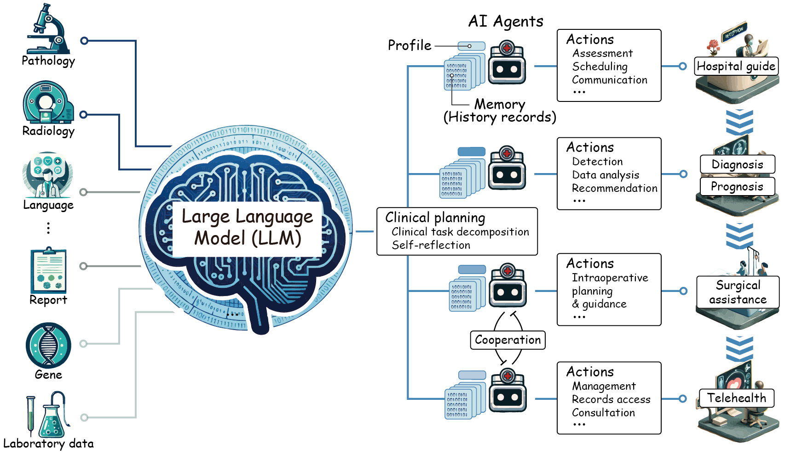

# Large Language Models Illuminate a Progressive Pathway to Artificial Healthcare Assistant: A Review

## 🔔 News
<!-- - 💥 [2023/09/15] Our survey is released! See [The Rise and Potential of Large Language Model Based Agents: A Survey](https://arxiv.org/abs/2309.07864) for the paper! -->
- 💥 [2023/11/06] Our review paper is available at [here](https://arxiv.org/abs/2311.01918).
- ✨ [2023/11/03] We create this repository to maintain a paper list on Large Language Models (LLMs) in Medicine.

<div align=center></div>

## Introduction
In the fast-evolving landscape of artificial intelligence, Large Language Models (LLMs) have emerged as groundbreaking tools with the potential to emulate complex human linguistic abilities. Their profound impact on healthcare, a field at the crossroads of multifaceted data and intricate decision-making, is of immense interest. This repository delves into the integration challenges and showcases the breadth of LLMs' applications within the medical sphere.

Herein, we offer a curated anthology that navigates through the realm of **general-purpose and specialized LLMs**, elucidating their roles in enhancing medical research, streamlining clinical operations, and supporting diagnostic processes. We cast a spotlight on **multimodal LLMs**, championing their sophistication in harmonizing varied data streams such as medical imagery and electronic health records (EHRs) to refine diagnostic precision. Advancing into the frontiers of innovation, we explore **LLM-empowered autonomous healthcare agents**, scrutinizing their capacity for personalized care and intricate clinical reasoning. Additionally, we present a synthesis of **evaluative strategies** critical for verifying the dependability and security of LLMs within medical settings.

Our extensive analysis sheds light on the transformative promise LLMs hold for healthcare's future. Yet, we underscore the indispensable call for ongoing refinement and ethical vigilance as precursors to their successful clinical integration.

Please note: This repository's scope is centered on the **technological evolution of LLMs in medicine**. For insights into clinical deployments and applications of LLMs, we invite you to consult [our comprehensive review](https://arxiv.org/pdf/2311.01918.pdf).

**We sincerely value all contributions, whether through pull requests, issue reports, emails, or other forms of communication.**

## Table of Content (ToC)
- [Introduction](#introduction)
- [Specialized Medical LLMs](#specialized-medical-llms)
- [Multimodal LLMs in Medicine](#multimodal-llms-in-medicine)
- [LLM-Powered Healthcare Agents](#llm-powered-healthcare-agents)
- [Evaluation](#evaluation)
    - [Strategies](#strategies)
    - [Comparative Studies](#comparative-studies)
- [Valuable Resources](#valuable-resources)
    - [Related Surveys](#related-surveys)
        - [LLM Techniques](#llm-techniques)
        - [LLMs in Medicine](#llms-in-medicine)
    - [Repositories](#repositories)
- [Project Maintainers \& Contributors](#project-maintainers--contributors)
- [Citing](#citing)
- [Acknowledgement](#acknowledgement)

## Specialized Medical LLMs
- [2023/11] **MEDITRON-70B: Scaling Medical Pretraining for Large Language Models** *Zeming Chen et al. arXiv.* [[paper](https://arxiv.org/abs/2311.16079)][[code](https://github.com/epfLLM/meditron)]
- [2023/11] **Taiyi: A Bilingual Fine-Tuned Large Language Model for Diverse Biomedical Tasks** *Ling Luo et al. arXiv.* [[paper](https://arxiv.org/abs/2311.11608)][[code](https://github.com/DUTIR-BioNLP/Taiyi-LLM)]
- [2023/11] **HuatuoGPT-II, One-stage Training for Medical Adaption of LLMs** *Junying Chen et al. arXiv.* [[paper](https://arxiv.org/abs/2311.09774)][[code](https://github.com/FreedomIntelligence/HuatuoGPT-II)]
- [2023/10] **AlpaCare:Instruction-tuned Large Language Models for Medical Application** *Zhang et al. arXiv.* [[paper](https://arxiv.org/abs/2310.14558)] [[code](https://github.com/XZhang97666/AlpaCare)]
- [2023/10] **ChatRadio-Valuer: A Chat Large Language Model for Generalizable Radiology Report Generation Based on Multi-institution and Multi-system Data** *Zhong et al. arXiv.* [[paper](https://arxiv.org/abs/2310.05242)]
- [2023/10] **Publicly Shareable Clinical Large Language Model Built on Synthetic Clinical Notes** *Sunjun Kweon et al. arXiv.* [[paper](https://arxiv.org/abs/2309.00237)] [[code](https://github.com/starmpcc/Asclepius)]
- [2023/09] **HealGPT** *GR-Tech.* [[code](https://github.com/TONYCHANBB/HealGPT)] [[demo](http://heal-gpt.cn/)]
- [2023/09] **MedChatZH: a Better Medical Adviser Learns from Better Instructions** *Tan et al. arXiv.* [[paper](https://arxiv.org/abs/2309.01114)] [[code](https://github.com/tyang816/MedChatZH)]
- [2023/09] **CPLLM: Clinical Prediction with Large Language Models** *Shoham et al. arXiv.* [[paper](https://arxiv.org/abs/2309.11295)]
- [2023/09] **Radiology-Llama2: Best-in-Class Large Language Model for Radiology** *Liu et al. arXiv.* [[paper](https://arxiv.org/abs/2309.06419)]
- [2023/08] **Zhongjing: Enhancing the Chinese Medical Capabilities of Large Language Model through Expert Feedback and Real-world Multi-turn Dialogue** *Songhua Yang et al. arXiv.* [[paper](https://arxiv.org/abs/2308.03549)] [[code](https://github.com/SupritYoung/Zhongjing)]
- [2023/08] **DISC-MedLLM: Bridging General Large Language Models and Real-World Medical Consultation** *Zhijie Bao et al. arXiv.* [[paper](https://arxiv.org/abs/2308.14346)] [[code](https://github.com/FudanDISC/DISC-MedLLM)]
- [2023/08] **CareGPT: Medical LLM, Open Source Driven for a Healthy Future** *Rongsheng Wang et al.* [[code](https://github.com/WangRongsheng/CareGPT)]
- [2023/07] **HuangDi: A Generative Large Language Model for Ancient Chinese Medical Texts** *Jundong Zhang et al.* [[code](https://github.com/Zlasejd/HuangDi)]
- [2023/07] **MING: A Chinese Medical Consultation Large Model** *Yusheng Liao et al.* [[code](https://github.com/MediaBrain-SJTU/MING)]
- [2023/06] **TCMLLM** *Xuezhong Zhou et al.* [[code](https://github.com/2020MEAI/TCMLLM)]
- [2023/06] **PULSE** *OpenMedLab*. [[code](https://github.com/openmedlab/PULSE)]
- [2023/06] **Sunsimiao: Chinese Medicine LLM** *Xin Yan et al.* [[code](https://github.com/thomas-yanxin/Sunsimiao)]
- [2023/06] **ShenNong-TCM: A Traditional Chinese Medicine Large Language Model** *Wei Zhu et al.* [[code](https://github.com/michael-wzhu/ShenNong-TCM-LLM)]
- [2023/06] **Radiology-GPT: A Large Language Model for Radiology** *Zhengliang Liu et al. arXiv.* [[paper](https://arxiv.org/abs/2306.08666)] [[code](https://huggingface.co/spaces/allen-eric/radiology-gpt)]
- [2023/06] **MedicalGPT: Training Medical GPT Model** *Ming Xu et al.* [[code](https://github.com/shibing624/MedicalGPT)]
- [2023/06] **ClinicalGPT: Large Language Models Finetuned with Diverse Medical Data and Comprehensive Evaluation** *Guangyu Wang et al. arXiv.* [[paper](https://arxiv.org/abs/2306.09968)]
- [2023/05] **CAMEL: Clinically Adapted Model Enhanced from LLaMA** *Sunjun Kweon et al.* [[code](https://github.com/starmpcc/CAMEL)] [[blog](https://starmpcc.github.io/CAMEL/)]
- [2023/05] **Clinfo.AI: Answer Clinical Questions Grounded in Medical Literature** *Alejandro Lozano et al.* [[code](https://github.com/som-shahlab/Clinfo.AI)]
- [2023/05] **Towards Expert-Level Medical Question Answering with Large Language Models** *Karan Singhal et al. arXiv.* [[paper](https://arxiv.org/abs/2305.09617)]
- [2023/05] **CMLM-ZhongJing: Large Language Model is Good Story Listener** *Yanlan Kang et al.* [[code](https://github.com/pariskang/CMLM-ZhongJing)]
- [2023/05] **QiZhenGPT: An Open Source Chinese Medical Large Language Model** *Yao Chang et al.* [[code](https://github.com/CMKRG/QiZhenGPT)]
- [2023/05] **HuatuoGPT, towards Taming Language Model to Be a Doctor** *Hongbo Zhang et al. arXiv.* [[paper](https://arxiv.org/abs/2305.15075)] [[code](https://github.com/FreedomIntelligence/HuatuoGPT)]
- [2023/05] **Clinical Camel: An Open Expert-Level Medical Language Model with Dialogue-Based Knowledge Encoding** *Toma et al. arXiv.* [[paper](https://arxiv.org/abs/2305.12031)] [[code](https://huggingface.co/wanglab)]
- [2023/04] **BianQue: Balancing the Questioning and Suggestion Ability of Health LLMs with Multi-turn Health Conversations Polished by ChatGPT** *Yirong Chen et al. arXiv.* [[paper](https://arxiv.org/abs/2310.15896)] [[code](https://github.com/scutcyr/BianQue)]
- [2023/04] **ChatMed: A Chinese Medical Large Language Model** *Wei Zhu et al.* [[code](https://github.com/michael-wzhu/ChatMed)]
- [2023/04] **DoctorGLM: Fine-tuning your Chinese Doctor is not a Herculean Task** *Honglin Xiong et al. arXiv.* [[paper](https://arxiv.org/abs/2304.01097)] [[code](https://github.com/xionghonglin/DoctorGLM)]
- [2023/04] **PMC-LLaMA: Towards Building Open-source Language Models for Medicine** *Chaoyi Wu et al. arXiv.* [[paper](https://arxiv.org/abs/2304.14454)] [[code](https://github.com/chaoyi-wu/PMC-LLaMA)]
- [2023/04] **HuaTuo: Tuning LLaMA Model with Chinese Medical Knowledge** *Haochun Wang et al. arXiv.* [[paper](https://arxiv.org/abs/2304.06975)] [[code](https://github.com/SCIR-HI/Huatuo-Llama-Med-Chinese)]
- [2023/04] **Doctor Dignity** *Siraj Raval et al.* [[code](https://github.com/llSourcell/Doctor-Dignity)]
- [2023/04] **MedAlpaca--An Open-Source Collection of Medical Conversational AI Models and Training Data** *Tianyu Han et al. arXiv.* [[paper](https://arxiv.org/abs/2304.08247)] [[code](https://github.com/kbressem/medAlpaca)]
- [2023/03] **Palmyra-Large Parameter Autoregressive Language Model** *Writer Engineering team.* [[code](https://huggingface.co/Writer/palmyra-med-20b)]
- [2023/03] **ChatGLM-Med** *Haochun Wang et al.* [[code](https://github.com/SCIR-HI/Med-ChatGLM)]
- [2023/03] **ChatDoctor: A Medical Chat Model Fine-Tuned on a Large Language Model Meta-AI (LLaMA) Using Medical Domain Knowledge** *Yunxiang Li et al. Cureus.* [[paper](https://www.ncbi.nlm.nih.gov/pmc/articles/PMC10364849/)] [[code](https://github.com/Kent0n-Li/ChatDoctor)]
- [2022/12] **A large language model for electronic health records** *Xi Yang et al. npj Digital Medicine.* [[paper](https://www.nature.com/articles/s41746-022-00742-2)] [[code](https://github.com/uf-hobi-informatics-lab/GatorTron)]
- [2022/12] **Large language models encode clinical knowledge** *Karan Singhal et al. Nature.* [[paper](https://www.nature.com/articles/s41586-023-06291-2)] [[code](https://huggingface.co/google/flan-t5-xl)]
- [2022/10] **Health system-scale language models are all-purpose prediction engines** *Lavender Yao Jiang et al. Nature.* [[paper](https://www.nature.com/articles/s41586-023-06160-y)] [[code](https://github.com/nyuolab/NYUTron)]

## Multimodal LLMs in Medicine
- [2023/10] **Qilin-Med-VL: Towards Chinese Large Vision-Language Model for General Healthcare** *Junling Liu et al. arXiv.* [[paper](https://arxiv.org/abs/2310.17956)] [[code](https://github.com/williamliujl/Qilin-Med-VL)]
- [2023/08] **ELIXR: Towards a general purpose X-ray artificial intelligence system through alignment of large language models and radiology vision encoders** *Shawn Xu et al. arXiv.* [[paper](https://arxiv.org/abs/2308.01317)]
- [2023/08] **Towards Generalist Foundation Model for Radiology by Leveraging Web-scale 2D&3D Medical Data** *Chaoyi Wu et al. arXiv.* [[paper](https://arxiv.org/abs/2308.02463)] [[code](https://github.com/chaoyi-wu/RadFM)]
- [2023/08] **BioMedGPT: Open Multimodal Generative Pre-trained Transformer for BioMedicine** *Yizhen Luo et al. arXiv.* [[paper](https://arxiv.org/abs/2308.09442)] [[code](https://github.com/PharMolix/OpenBioMed)]
- [2023/07] **Multimodal LLMs for health grounded in individual-specific data** *Anastasiya Belyaeva et al. arXiv.* [[paper](https://arxiv.org/abs/2307.09018)] [[blog](https://blog.research.google/2023/08/multimodal-medical-ai.html)]
- [2023/07] **Med-Flamingo: a Multimodal Medical Few-shot Learner** *Michael Moor et al. arXiv.* [[paper](https://arxiv.org/abs/2307.15189)] [[code](https://github.com/snap-stanford/med-flamingo)]
- [2023/07] **Towards Generalist Biomedical AI** *Tao Tu et al. arXiv.* [[paper](https://arxiv.org/abs/2307.14334)] [[code](https://github.com/kyegomez/Med-PaLM)]
- [2023/07] **CephGPT-4: An Interactive Multimodal Cephalometric Measurement and Diagnostic System with Visual Large Language Model** *Lei Ma et al. arXiv.* [[paper](https://arxiv.org/abs/2307.07518)]
- [2023/06] **Lmflow: An extensible toolkit for finetuning and inference of large foundation models** *Shizhe Diao et al. arXiv.* [[code](https://github.com/OptimalScale/LMFlow)] [[paper](https://arxiv.org/abs/2306.12420)] [[blog](https://optimalscale.github.io/LMFlow/)]
- [2023/06] **XrayPULSE** *OpenMedLab.* [[code](https://github.com/openmedlab/XrayPULSE)]
- [2023/06] **XrayGPT: Chest Radiographs Summarization using Medical Vision-Language Models** *Omkar Thawkar et al. arXiv.* [[paper](https://arxiv.org/abs/2306.07971)] [[code](https://github.com/mbzuai-oryx/XRayGPT)]
- [2023/06] **LLaVA-Med: Training a Large Language-and-Vision Assistant for Biomedicine in One Day** *Chunyuan Li et al. arXiv.* [[paper](https://arxiv.org/abs/2306.00890)] [[code](https://github.com/microsoft/LLaVA-Med/blob/main/README.md)]
- [2023/05] **PMC-VQA: Visual Instruction Tuning for Medical Visual Question Answering** *Xiaoman Zhang et al. arXiv.* [[paper](https://arxiv.org/abs/2305.10415)] [[code](https://github.com/xiaoman-zhang/PMC-VQA)]
- [2023/05] **BiomedGPT: A Unified and Generalist Biomedical Generative Pre-trained Transformer for Vision, Language, and Multimodal Tasks** *Kai Zhang et al. arXiv.* [[paper](https://arxiv.org/abs/2305.17100)] [[code](https://github.com/taokz/BiomedGPT)]
- [2023/05] **PathAsst: Redefining Pathology through Generative Foundation AI Assistant for Pathology** *Yuxuan Sun et al. arXiv.* [[paper](https://arxiv.org/abs/2305.15072)] [[code](https://github.com/superjamessyx/Generative-Foundation-AI-Assistant-for-Pathology)]
- [2023/05] **XrayGLM: The first Chinese Medical Multimodal Model that Chest Radiographs Summarization** *Rongsheng Wang et al.* [[code](https://github.com/WangRongsheng/XrayGLM)]
- [2023/04] **SkinGPT-4: An Interactive Dermatology Diagnostic System with Visual Large Language Model** *Juexiao Zhou et al. arXiv.* [[paper](https://arxiv.org/abs/2304.10691)] [[code](https://github.com/JoshuaChou2018/SkinGPT-4)]
- [2023/04] **Visual Med-Alpaca: A Parameter-Efficient Biomedical LLM with Visual Capabilities** *Chang Shu et al.* [[blog](https://cambridgeltl.github.io/visual-med-alpaca/)] [[code](https://github.com/cambridgeltl/visual-med-alpaca)]

### GPT-4V
- [2023/11] **Performance of Multimodal GPT-4V on USMLE with Image: Potential for Imaging Diagnostic Support with Explanations** *Yang et al. medRxiv.* [[paper](https://www.medrxiv.org/content/10.1101/2023.10.26.23297629v3)]
- [2023/10] **Diagnostic Accuracy of GPT Multimodal Analysis on USMLE Questions Including Text and Visuals** *Sorin et al. medRxiv.* [[paper](https://www.medrxiv.org/content/10.1101/2023.10.29.23297733v1)]
- [2023/10] **Multimodal ChatGPT for Medical Applications: an Experimental Study of GPT-4V** *Yan et al. arXiv.* [[paper](https://arxiv.org/abs/2310.19061)]
- [2023/10] **A Comprehensive Study of GPT-4V's Multimodal Capabilities in Medical Imaging** *Li et al. arXiv.* [[paper](https://arxiv.org/abs/2310.20381)]
- [2023/10] **Can GPT-4V(ision) Serve Medical Applications? Case Studies on GPT-4V for Multimodal Medical Diagnosis** *Wu et al. arXiv.* [[paper](https://arxiv.org/abs/2310.09909)]
- [2023/09] **The Dawn of LMMs: Preliminary Explorations with GPT-4V(ision)** *Yang et al. arXiv.* [[paper](https://arxiv.org/abs/2309.17421)]

## LLM-Powered Healthcare Agents
- [2023/11] **MedAgents: Large Language Models as Collaborators for Zero-shot Medical Reasoning** *Tang et al. arXiv.* [[paper](https://arxiv.org/abs/2311.10537)] [[code](https://github.com/gersteinlab/MedAgents)]
- [2023/10] **Conversational Health Agents: A Personalized LLM-Powered Agent Framework** *Mahyar Abbasian et al. arXiv.* [[paper](https://arxiv.org/abs/2310.02374)]
- [2023/07] **PharmacyGPT: The AI Pharmacist** *Zhengliang Liu et al. arXiv.* [[paper](https://arxiv.org/abs/2307.10432)]
- [2023/07] **Advanced prompting as a catalyst: Empowering large language models in the management of gastrointestinal cancers** *Jiajia Yuan et al. The Innovation Medicine.* [[paper](https://the-innovation.org/data/article/medicine/preview/pdf/XINNMEDICINE-2023-0065.pdf)]
- [2023/06] **AD-AutoGPT: An Autonomous GPT for Alzheimer's Disease Infodemiology** *Haixing Dai et al. arXiv.* [[paper](https://arxiv.org/abs/2306.10095)]
- [2023/05] **ChatCAD+: Towards a Universal and Reliable Interactive CAD using LLMs** *Zihao Zhao et al. arXiv.* [[paper](https://arxiv.org/abs/2305.15964)] [[code](https://github.com/zhaozh10/ChatCAD)]
- [2023/05] **PathAsst: Redefining Pathology through Generative Foundation AI Assistant for Pathology** *Yuxuan Sun et al. arXiv.* [[paper](https://arxiv.org/abs/2305.15072)] [[code](https://github.com/superjamessyx/Generative-Foundation-AI-Assistant-for-Pathology)]
- [2023/04] **ImpressionGPT: An Iterative Optimizing Framework for Radiology Report Summarization with ChatGPT** *Chong Ma et al. arXiv.* [[paper](https://arxiv.org/abs/2304.08448)] [[code](https://github.com/MoMarky/ImpressionGPT)]
- [2023/04] **GeneGPT: Augmenting Large Language Models with Domain Tools for Improved Access to Biomedical Information** *Jin et al. arXiv.* [[paper](https://arxiv.org/abs/2304.09667)]
- [2023/03] **Almanac: Retrieval-Augmented Language Models for Clinical Medicine** *Zakka et al. Research Square.* [[paper](https://arxiv.org/abs/2303.01229)]

## Evaluation

### Strategies
- [2023/09] **An Automatic Evaluation Framework for Multi-turn Medical Consultations Capabilities of Large Language Models** *Liao et al. arXiv.* [[paper](https://arxiv.org/abs/2309.02077)]
- [2023/09] **Safetybench: Evaluating the safety of large language models with multiple choice questions.** *Zhexin Zhang et al. arXiv.* [[paper](https://arxiv.org/abs/2309.07045)] [[code](https://github.com/thu-coai/SafetyBench)]
- [2023/08] **LLM-Mini-CEX: Automatic Evaluation of Large Language Model for Diagnostic Conversation** *Xiaoming Shi et al. arXiv.* [[paper](https://arxiv.org/abs/2308.07635)]
- [2023/07] **Med-HALT: Medical Domain Hallucination Test for Large Language Models.** *Ankit Pal et al. EMNLP'23.* [[paper](https://arxiv.org/abs/2307.15343)] [[code](https://github.com/medhalt/medhalt)]
- [2023/06] **Faithful AI in Medicine: A Systematic Review with Large Language Models and Beyond.** *Qianqian Xie et al. medRxiv.* [[paper](https://www.medrxiv.org/content/10.1101/2023.04.18.23288752v3)]
- [2023/05] **MedGPTEval: A Dataset and Benchmark to Evaluate Responses of Large Language Models in Medicine** *Jie Xu et al. arXiv.* [[paper](https://arxiv.org/abs/2305.07340)]
- [2023/05] **Can Large Language Models Be an Alternative to Human Evaluations?** *Cheng-Han Chiang et al. ACL'23.* [[paper](https://arxiv.org/abs/2305.01937)]
- [2023/04] **Exploring the Use of Large Language Models for Reference-Free Text Quality Evaluation: An Empirical Study** *Yi Chen et al. arXiv.* [[paper](https://arxiv.org/abs/2304.00723)]
- [2023/03] **G-Eval: NLG Evaluation using GPT-4 with Better Human Alignment** *Yang Liu et al. arXiv.* [[paper](https://arxiv.org/abs/2303.16634)] [[code](https://github.com/nlpyang/geval)]
- [2023/02] **GPTScore: Evaluate as You Desire** *Jinlan Fu et al. arXiv.* [[paper](https://arxiv.org/abs/2302.04166)] [[code](https://github.com/jinlanfu/GPTScore/blob/main/README.md)]

### Comparative Studies
- [2023/08] **Evaluating large language models on medical evidence summarization.** *Liyan Tang et al. npj Digital Medicine.* [[paper](https://www.nature.com/articles/s41746-023-00896-7)]
- [2023/07] **Evaluating Large Language Models for Radiology Natural Language Processing.** *Zhengliang Liu et al. arXiv.* [[paper](https://arxiv.org/abs/2307.13693)]
- [2023/04] **Are Large Language Models Ready for Healthcare? A Comparative Study on Clinical Language Understanding.** *Yuqing Wang et al. arXiv.* [[paper](https://arxiv.org/abs/2304.05368)]

## Valuable Resources
### Related Surveys
#### LLM Techniques
- [2023/09] **The Rise and Potential of Large Language Model Based Agents: A Survey.** *Zhiheng Xi et al. arXiv.* [[paper](https://arxiv.org/abs/2309.07864)] [[code](https://github.com/WooooDyy/LLM-Agent-Paper-List)]
- [2023/08] **Instruction Tuning for Large Language Models: A Survey.** *Shengyu Zhang et al. arXiv.* [[paper](https://arxiv.org/abs/2308.10792)] [[code](https://github.com/xiaoya-li/Instruction-Tuning-Survey)]
- [2023/07] **A Survey on Evaluation of Large Language Models.** *Yupeng Chang et al. arXiv.* [[paper](https://arxiv.org/abs/2307.03109)] [[code](https://github.com/MLGroupJLU/LLM-eval-survey)]
- [2023/07] **Aligning Large Language Models with Human: A Survey.** *Yufei Wang et al. arXiv.* [[paper](https://arxiv.org/abs/2307.12966)] [[code](https://github.com/GaryYufei/AlignLLMHumanSurvey)]
- [2023/06] **A Survey on Multimodal Large Language Models.** *Shukang Yin et al. arXiv.* [[paper](https://arxiv.org/abs/2306.13549)] [[code](https://github.com/BradyFU/Awesome-Multimodal-Large-Language-Models)]
- [2023/04] **Harnessing the Power of LLMs in Practice: A Survey on ChatGPT and Beyond.** *Jingfeng Yang et al. arXiv.* [[paper](https://arxiv.org/abs/2304.13712)]
- [2023/03] **A survey of large language models.** *Wayne Xin Zhao et al. arXiv.* [[paper](https://arxiv.org/abs/2303.18223)] [[code](https://github.com/RUCAIBox/LLMSurvey)]
- [2023/03] **Language Model Behavior: A Comprehensive Survey.** *Tyler A. Chang, Benjamin K. Bergen. arXiv.* [[paper](https://arxiv.org/abs/2303.11504)]
- [2023/02] **Augmented Language Models: a Survey.** *Grégoire Mialon et al. arXiv.* [[paper](https://arxiv.org/abs/2302.07842)]
- [2022/12] **Towards Reasoning in Large Language Models: A Survey.** *Jie Huang, Kevin Chen-Chuan Chang. ACL'23 Findings* [[paper](https://arxiv.org/abs/2212.10403)]

#### LLMs in Medicine
- [2023/11] **A Survey of Large Language Models in Medicine: Progress, Application, and Challenge.** *Hongjian Zhou et al. arXiv.* [[paper](http://arxiv.org/abs/2311.05112)]
- [2023/10] **A Survey of Large Language Models for Healthcare: from Data, Technology, and Applications to Accountability and Ethics.** *Kai He et al. arXiv.* [[paper](https://arxiv.org/abs/2310.05694)]
- [2023/09] **Large language models in medicine: the potentials and pitfalls.** *Jesutofunmi A. Omiye et al. arXiv.* [[paper](https://arxiv.org/abs/2309.00087)]
- [2023/09] **Artificial General Intelligence for Radiation Oncology.** *Chenbin Liu et al. arXiv.* [[paper](https://arxiv.org/abs/2309.02590)]
- [2023/07] **Large language models in medicine.** *Arun James Thirunavukarasu et al. Nature Medicine.* [[paper](https://www.nature.com/articles/s41591-023-02448-8)]
- [2023/05] **The current and future state of AI interpretation of medical images.** *Pranav Rajpurkar and Matthew P. Lungren. New England Journal of Medicine.*  [[paper](https://www.nejm.org/doi/pdf/10.1056/NEJMra2301725)]
- [2023/04] **Utility of ChatGPT in Clinical Practice.** *Jialin Liu et al. Journal of Medical Internet Research.*  [[paper](https://www.jmir.org/2023/1/e48568)]
- [2023/04] **Foundation models for generalist medical artificial intelligence.** *Michael Moor et al. Nature.* [[paper](https://www.nature.com/articles/s41586-023-05881-4)]
- [2023/03] **Large AI Models in Health Informatics: Applications, Challenges, and the Future**. *Jianing Qiu et al. IEEE Journal of Biomedical and Health Informatics.* [[paper](https://arxiv.org/abs/2303.11568)]
- [2023/03] **ChatGPT Utility in Healthcare Education, Research, and Practice: Systematic Review on the Promising Perspectives and Valid Concerns.** *Malik Sallam. Healthcare.* [[paper](https://www.mdpi.com/2227-9032/11/6/887)]
- [2023/03] **ChatGPT in Healthcare: A Taxonomy and Systematic Review.** *Jianning Li et al. medRxiv.* [[paper](https://www.medrxiv.org/content/10.1101/2023.03.30.23287899v1)]

### Repositories
- [Awesome-Medical-Healthcare-Dataset-For-LLM](https://github.com/onejune2018/Awesome-Medical-Healthcare-Dataset-For-LLM)
- [Awesome-LLM](https://github.com/Hannibal046/Awesome-LLM)
- [Awesome-Chinese-LLM](https://github.com/HqWu-HITCS/Awesome-Chinese-LLM)
- [CareGPT](https://github.com/WangRongsheng/CareGPT) with curated references

## Project Maintainers & Contributors
- [Mingze Yuan](https://github.com/mingze-yuan) (mzyuan@pku.edu.cn)
- [Peng Bao](https://github.com/pengbao7598)
- [Zifan Chen](https://github.com/czifan)

## Citing
If you find this repository useful in your research, please consider citing it.
```
@article{yuan2023large,
  title={Large Language Models Illuminate a Progressive Pathway to Artificial Healthcare Assistant: A Review},
  author={Yuan, Mingze and Bao, Peng and Yuan, Jiajia and Shen, Yunhao and Chen, Zifan and Xie, Yi and Zhao, Jie and Chen, Yang and Zhang, Li and Shen, Lin and others},
  journal={arXiv preprint arXiv:2311.01918},
  year={2023}
}
```

## Licenses
[](https://lbesson.mit-license.org/) This project is licensed under the terms of the [MIT License](https://lbesson.mit-license.org/).

## Acknowledgement
We have structured our repository by drawing inspiration from the substantial work of repositories such as [LLM-Agent-Paper-List](https://github.com/WooooDyy/LLM-Agent-Paper-List/tree/main), [CareGPT](https://github.com/WangRongsheng/CareGPT), and insights from [RadLLM](https://arxiv.org/pdf/2307.13693.pdf). We extend our sincere gratitude to their contributions.
